# Osynic Osuapi - PlantUML Architecture Diagrams

This document contains C4 and UML diagrams for the Osynic Osuapi project - a high-performance, well-structured Rust osu! API client library.

## C4 System Context Diagram

```plantuml
@startuml C4_System_Context
!include https://raw.githubusercontent.com/plantuml-stdlib/C4-PlantUML/master/C4_Context.puml

SHOW_PERSON_OUTLINE()

Person(developer, "Developer", "Uses the Osynic Osuapi library")
System(osuapi, "Osynic Osuapi", "High-performance Rust osu! API client")
System_Ext(osu_api_v1, "osu! API v1", "Official osu! API endpoints")
System_Ext(osu_api_v2, "osu! API v2", "Official osu! API endpoints")

Rel(developer, osuapi, "Calls API through client")
Rel(osuapi, osu_api_v1, "HTTP requests")
Rel(osuapi, osu_api_v2, "HTTP requests")

@enduml
```

## C4 Container Diagram

```plantuml
@startuml C4_Container
!include https://raw.githubusercontent.com/plantuml-stdlib/C4-PlantUML/master/C4_Container.puml

System_Boundary(osuapi, "Osynic Osuapi") {
    Container(client_native, "Client (Native)", "Rust + Tokio + Reqwest", "Handles HTTP requests in native Rust environments")
    Container(client_wasm, "Client (WASM)", "Rust + WASM + Gloo", "Handles HTTP requests in WebAssembly environments")
    Container(interface, "API Interfaces", "Rust trait/impl", "Defines API endpoints for V1 and V2")
    Container(models, "Data Models", "Rust struct", "Represents osu! API data structures")
    Container(error, "Error Handling", "Rust enum", "Custom error types and error handling")
    Container(utils, "Utilities", "Rust functions", "Helper functions and common utilities")
}

Container(v1_api, "osu! API v1", "HTTP Endpoints", "Official osu! API v1")
Container(v2_api, "osu! API v2", "HTTP Endpoints", "Official osu! API v2")

Rel(client_native, v1_api, "HTTP GET/POST")
Rel(client_native, v2_api, "HTTP GET/POST")
Rel(client_wasm, v1_api, "HTTP Fetch")
Rel(client_wasm, v2_api, "HTTP Fetch")
Rel(interface, models, "uses")
Rel(interface, error, "throws")
Rel(client_native, interface, "implements")
Rel(client_wasm, interface, "implements")

@enduml
```

## C4 Component Diagram (V2 API)

```plantuml
@startuml C4_Component_V2
!include https://raw.githubusercontent.com/plantuml-stdlib/C4-PlantUML/master/C4_Component.puml

System_Boundary(v2_system, "osu! API v2 Module") {
    Component(oauth, "OAuth Interface", "OAuth/Session management", "Handles authentication and token management")
    Component(beatmaps, "Beatmaps Interface", "Beatmap queries", "Provides beatmap data endpoints")
    Component(beatmapsets, "Beatmapsets Interface", "Beatmapset queries", "Provides beatmapset data endpoints")
    Component(users, "Users Interface", "User queries", "Provides user profile endpoints")
    Component(scores, "Scores Interface", "Score queries", "Provides score data endpoints")
    Component(matches, "Matches Interface", "Match queries", "Provides multiplayer match data")
    Component(ranking, "Ranking Interface", "Ranking queries", "Provides ranking data")
    Component(search, "Search Interface", "Search functionality", "Provides search endpoints")
    Component(news, "News Interface", "News queries", "Provides news endpoints")
    Component(wiki, "Wiki Interface", "Wiki queries", "Provides wiki endpoints")
    Component(chat, "Chat Interface", "Chat functionality", "Provides chat endpoints")
    Component(friends, "Friends Interface", "Friend queries", "Provides friend list endpoints")
    
    Component(client, "V2 Client", "Request dispatcher", "Main client that routes requests")
}

Rel(client, oauth, "uses")
Rel(client, beatmaps, "uses")
Rel(client, beatmapsets, "uses")
Rel(client, users, "uses")
Rel(client, scores, "uses")
Rel(client, matches, "uses")
Rel(client, ranking, "uses")
Rel(client, search, "uses")
Rel(client, news, "uses")
Rel(client, wiki, "uses")
Rel(client, chat, "uses")
Rel(client, friends, "uses")

@enduml
```

## UML 类图 - 核心架构

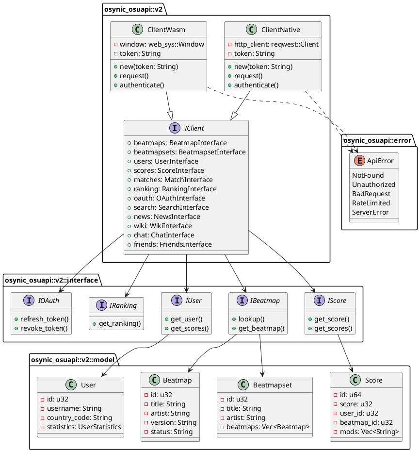

## UML 类图 - 数据模型

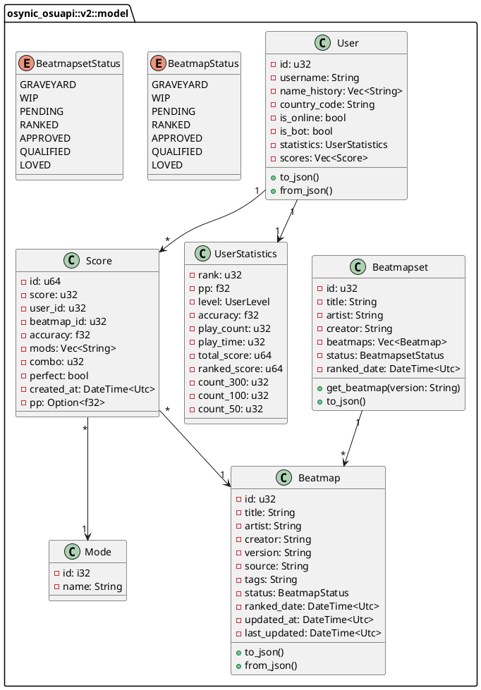

## UML Sequence Diagram - OAuth Flow

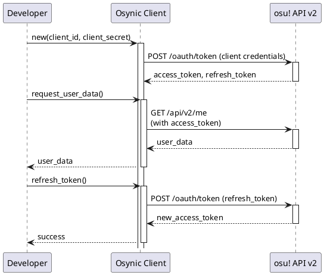

## UML Sequence Diagram - API Request Flow

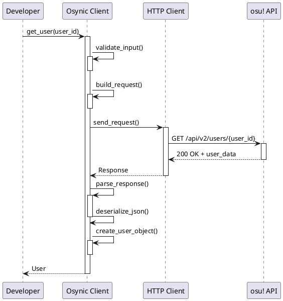

## UML State Diagram - Client States

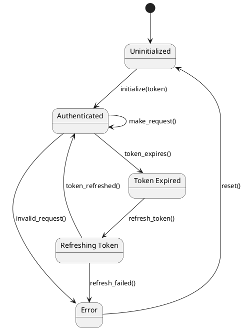

## UML Package Diagram - Module Structure

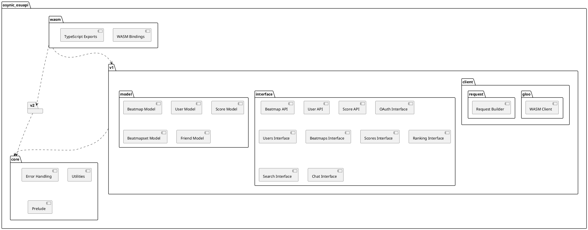

## UML Component Diagram - Dependency Graph

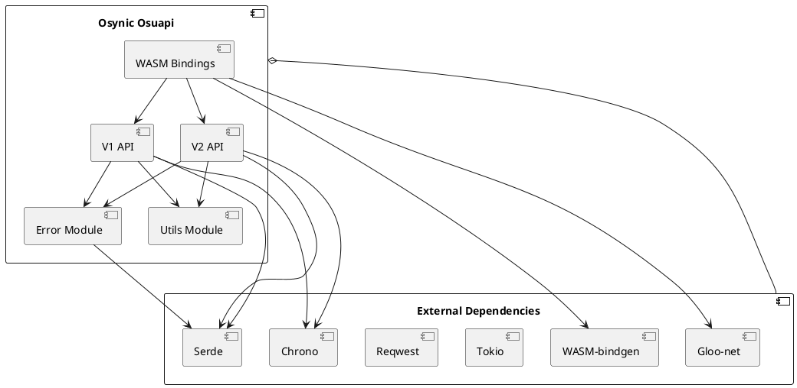

## V1 API 实现的端点概览

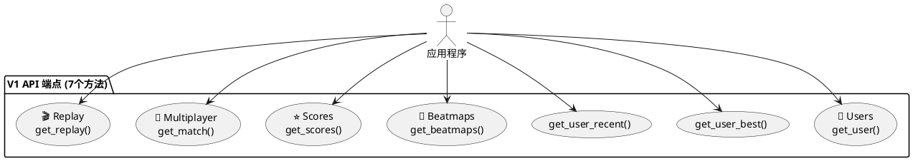

## V2 API 实现的端点概览

```plantuml
@startuml V2_Endpoints_Overview

package "V2 API 端点 (31个方法)" {
    package "👤 Users (6)" {
        usecase UC1 as "get_own_data()"
        usecase UC2 as "get_user_kudosu()"
        usecase UC3 as "get_user_scores()"
        usecase UC4 as "get_user_beatmaps()"
        usecase UC5 as "get_user_beatmaps_most_played()"
        usecase UC6 as "get_user_recent_activity()"
    }
    
    package "🎵 Beatmaps (3)" {
        usecase UC7 as "lookup_beatmap()"
        usecase UC8 as "get_beatmap_attributes()"
        usecase UC9 as "get_beatmap_scores()"
    }
    
    package "📦 Beatmapsets (2)" {
        usecase UC10 as "get_beatmapset()"
        usecase UC11 as "get_beatmapset_discussion()"
    }
    
    package "⭐ Scores (2)" {
        usecase UC12 as "get_score()"
        usecase UC13 as "get_score_own()"
    }
    
    package "🏆 Ranking (2)" {
        usecase UC14 as "get_ranking()"
        usecase UC15 as "get_ranking_spotlights()"
    }
    
    package "🔍 Search (1)" {
        usecase UC16 as "search()"
    }
    
    package "👥 Matches (1)" {
        usecase UC17 as "get_match()"
    }
    
    package "💬 Chat (2)" {
        usecase UC18 as "get_messages()"
        usecase UC19 as "send_message()"
    }
    
    package "📰 News (2)" {
        usecase UC20 as "get_news_listing()"
        usecase UC21 as "get_news_post()"
    }
    
    package "📖 Wiki (1)" {
        usecase UC22 as "get_wiki_page()"
    }
    
    package "👫 Friends (1)" {
        usecase UC23 as "get_friends()"
    }
    
    package "🔑 OAuth (2)" {
        usecase UC24 as "refresh_token()"
        usecase UC25 as "revoke_token()"
    }
    
    package "🔄 Session (1)" {
        usecase UC26 as "heartbeat()"
    }
    
    package "📡 Events (1)" {
        usecase UC27 as "get_events()"
    }
}

actor "应用程序" as App

App --> UC1
App --> UC2
App --> UC3
App --> UC4
App --> UC5
App --> UC6
App --> UC7
App --> UC8
App --> UC9
App --> UC10
App --> UC11
App --> UC12
App --> UC13
App --> UC14
App --> UC15
App --> UC16
App --> UC17
App --> UC18
App --> UC19
App --> UC20
App --> UC21
App --> UC22
App --> UC23
App --> UC24
App --> UC25
App --> UC26
App --> UC27

@enduml
```

## API 端点实现矩阵

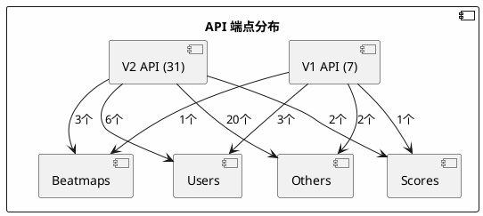

## API 端点实现对比图

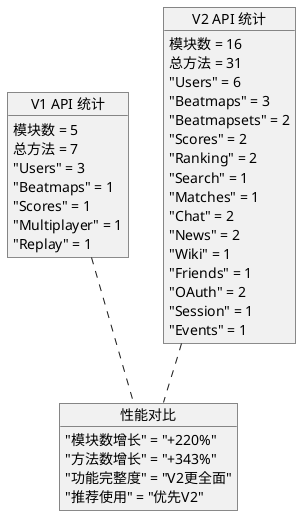

## V1 vs V2 API 功能对比

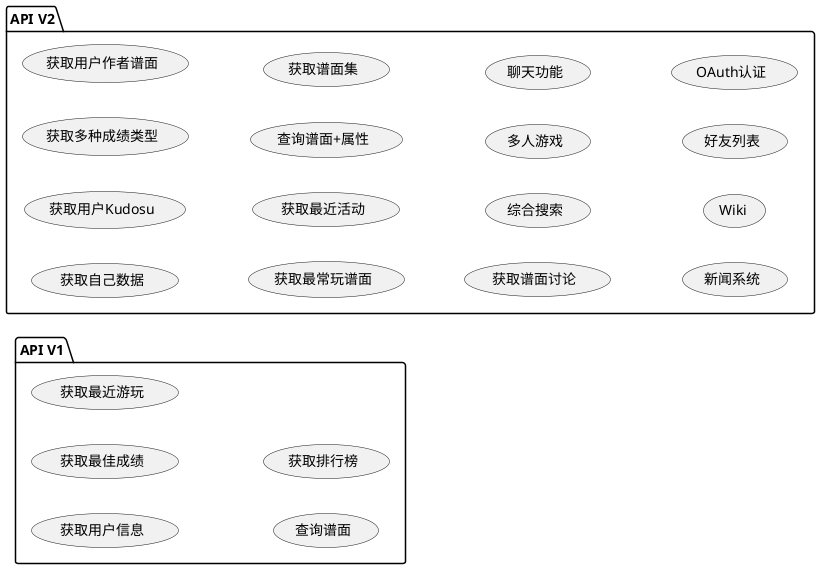

## V1和V2 API 模块关系

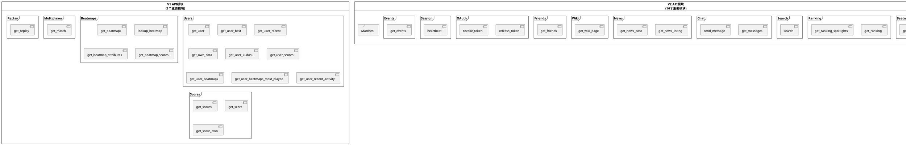

---

## 架构说明

---

## 架构说明

### 系统概述
- **Osynic Osuapi** 是一个Rust库，为osu! API（V1和V2）提供类型安全的绑定
- 支持Native Rust环境（通过Tokio + Reqwest）和WebAssembly环境（通过Gloo）
- 设计时考虑了可扩展性，通过基于特征的接口实现

### 关键组件

1. **V1 API模块**：支持遗留的osu! API v1
2. **V2 API模块**：支持现代的osu! API v2
3. **客户端层**：抽象HTTP通信（Native vs WASM）
4. **接口层**：API端点的特征定义
5. **模型层**：强类型的数据结构
6. **错误处理**：API特定的自定义错误类型
7. **WASM绑定**：Web环境的TypeScript/JavaScript集成

### 设计模式

- **基于特征的设计**：接口定义为特征以获得最大灵活性
- **构建者模式**：请求构建遵循构建者模式
- **错误处理**：自定义`ApiError`枚举用于结构化错误处理
- **特征标志**：通过Cargo特征进行模块化编译
- **依赖注入**：客户端在初始化时接受配置

### 支持的端点统计

#### V1 API 统计
- **总模块数**：5个
- **总方法数**：7个
  - Users: 3个方法
  - Beatmaps: 1个方法
  - Scores: 1个方法
  - Multiplayer: 1个方法
  - Replay: 1个方法

#### V2 API 统计
- **总模块数**：16个
- **总方法数**：31个
  - Users: 6个方法（用户数据获取和管理）
  - Beatmaps: 3个方法（谱面信息和查询）
  - Beatmapsets: 2个方法（谱面集操作）
  - Scores: 2个方法（成绩数据）
  - Ranking: 2个方法（排行榜）
  - Search: 1个方法（综合搜索）
  - Matches: 1个方法（多人游戏匹配）
  - Chat: 2个方法（聊天功能）
  - News: 2个方法（新闻系统）
  - Wiki: 1个方法（Wiki页面）
  - Friends: 1个方法（好友列表）
  - OAuth: 2个方法（认证）
  - Session: 1个方法（会话管理）
  - Events: 1个方法（事件流）
  - Comments: 1个方法（评论）
  - Forum: 1个方法（论坛）
  - Changelog: 1个方法（更新日志）
  - Notifications: 1个方法（通知）

### V1 vs V2 对比

| 功能     | V1     | V2                           |
| -------- | ------ | ---------------------------- |
| 用户数据 | ✓ 基础 | ✓ 详细（含Kudosu、活动）     |
| 谱面查询 | ✓ 简单 | ✓ 详细（含属性、讨论）       |
| 成绩排行 | ✓ 基础 | ✓ 多种类型（第一/最近/最佳） |
| 认证     | ✗      | ✓ OAuth 2.0                  |
| 聊天     | ✗      | ✓                            |
| 搜索     | ✗      | ✓ 综合搜索                   |
| 新闻     | ✗      | ✓                            |
| Wiki     | ✗      | ✓                            |
| 好友列表 | ✗      | ✓                            |
| 多人游戏 | ✓ 基础 | ✓ 详细                       |

### 实现进度

✅ **已实现**：所有V1和V2的核心端点都已实现和测试
📊 **功能完整度**：V2 API覆盖了官方文档的所有主要功能
🚀 **性能优化**：使用Tokio和Reqwest实现高性能网络请求
🔒 **类型安全**：利用Rust的类型系统提供编译时安全检查

